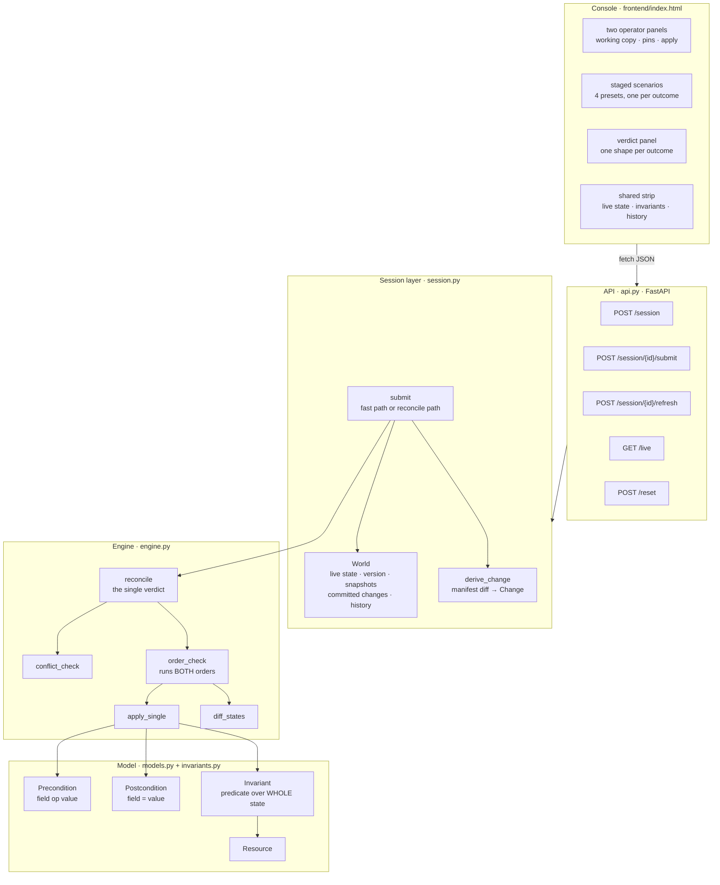
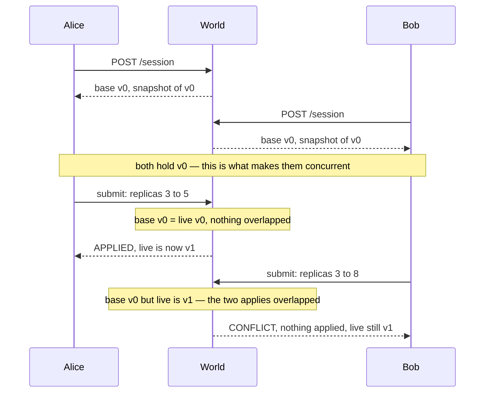
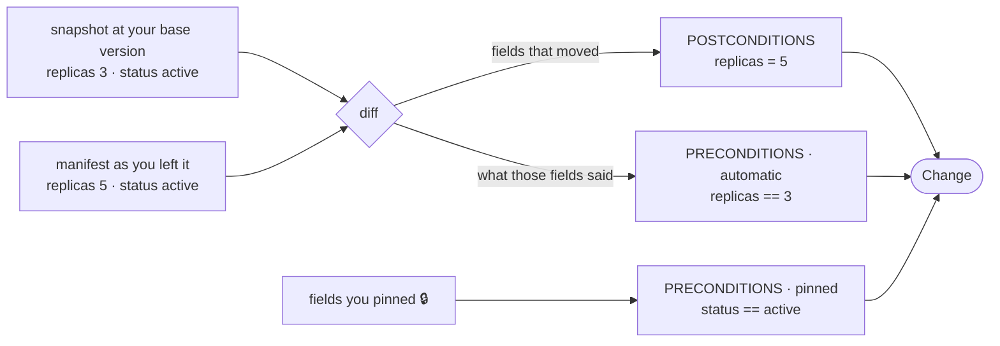
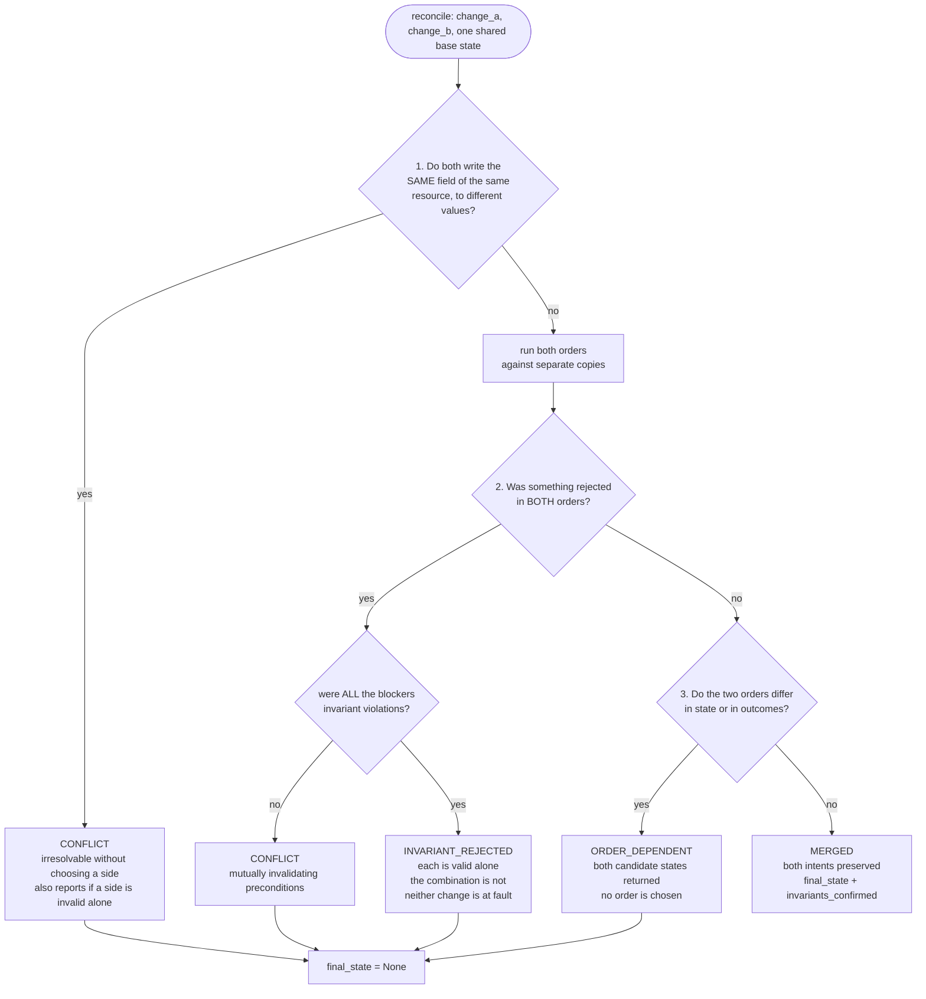

# ApplyMerge

Concurrent infrastructure changes are only meaningfully mergeable when each change
has explicit semantics, not when a model guesses what two operators "probably
meant." ApplyMerge is a simulated infrastructure state made of declarative
resources whose proposed changes include machine-readable preconditions, desired
postconditions, and invariants that must remain true. Two independent apply
operations may overlap in time and touch some of the same resources. The system
determines whether their effects commute, whether both intents can be preserved
in a single valid state, or whether the conflict is genuinely irresolvable
without choosing one side. It rejects combinations that violate declared
invariants rather than inventing a compromise. The final accepted state and any
rejected change are explainable directly from the declarative model and
automatically checked against its invariants.

Two operators edit the same state side by side. Nobody writes a change by hand:
what you edit becomes the postconditions, what you were looking at becomes the
preconditions, and whoever applies second is reconciled against whoever applied
first.

## Architecture

Five layers, one direction of dependency. The engine has no I/O, no clock and no
knowledge that sessions exist, so it can be tested in isolation and reused
unchanged above any substrate.



### What makes two applies concurrent

A session is stamped with the version that was live when it opened. That stamp is
the whole concurrency model: two edits built on the same version overlapped in
time, whatever the wall clock says.



### How an edit becomes a declarative change

Nobody writes preconditions by hand. `derive_change` diffs the submitted manifest
against the snapshot that session was handed.



The automatic preconditions are an optimistic lock — *I decided this while looking
at 3* — and they need no engine support at all: a stale write fails its own
precondition through the ordinary path.

A **pin** is the other half. It declares a field you are *relying on* but not
changing. Without a pin nothing reads a field it does not write, so no pair can be
order-dependent. The pin is what creates the read.

### How one apply is decided

`apply_single` is the only place state is ever written, and it writes to a **copy**.
A rejected change leaves the caller's state byte-identical.


### How the pair is classified

Branch order is load-bearing. "No order applies both" is tested **before** "the
orders diverge" — otherwise an unrealisable pair would be labelled
`ORDER_DEPENDENT`, implying some order works when none does.



Only `MERGED` yields a state. For the other three the absence of a state **is**
the answer — the system never invents a compromise.

## Running it

```
pip install -r requirements.txt
uvicorn apply_merge.api:app --port 8000
```

Open <http://127.0.0.1:8000/> for the console, `/docs` for the API, or
`/scenarios-view` for the canned four-scenario walkthrough.

```
pytest -q -p no:cacheprovider
```

## Using the console

1. Name the two operators and click **Open**. Both start at `v0`.
2. Edit any value in either working copy. Edited fields turn amber.
3. Optionally **🔒 pin** a field you are relying on but not changing.
4. **Your change** shows exactly what will be submitted — postconditions, automatic
   preconditions, and pinned ones — before you apply anything.
5. Apply on one side, then the other. The second one is the one being reconciled.

The four **preset** buttons stage each outcome: they reset the world, reopen both
sessions at `v0`, and fill both drafts. Presets are a shortcut, not a mode — the
staged edits go through the same diff → derive → reconcile path as anything typed
by hand, and editing a staged value before applying will change the verdict.

## The model

Four declarative pieces, all in `apply_merge/models.py`:

- **Resource** — an id, a type, and a bag of fields. `db-primary` is a `database`
  with `replicas: 3, status: "active", tier: "silver"`.
- **Precondition** — what must be true *before* a change may apply, as
  `field op value` using `==`, `!=`, `<=` or `>=`. A precondition on a field that
  does not exist does not hold.
- **Postcondition** — a field this change sets, and the value it sets it to.
  Always an assignment, never an expression, so two changes writing one field can
  be compared directly.
- **Invariant** — a named rule over the *whole* state that must hold after any
  apply. `replica_cap` sums replicas across every database; `ssh_not_public`
  inspects each security group. Both use the same signature, so per-resource and
  cross-resource rules are the same kind of thing.

A **Change** targets one resource and carries its preconditions, postconditions,
a description, and an origin.

## How to read a result

`reconcile(state, change_a, change_b)` returns exactly one of four outcomes. Three
of them produce **no state at all** — that absence is the answer, not an omission.

### MERGED

Both changes applied. The two write disjoint fields, both orders produce an
identical state, and every declared invariant was re-checked against the result.

The explanation names which fields were disjoint and lists the invariants
confirmed — not "OK", but `Invariants checked and confirmed: replica_cap,
ssh_not_public`.

In the console a concurrent change that merged and then landed is badged
**MERGED**; `APPLIED` is reserved for a change that had nothing to reconcile
against.

### CONFLICT

Both changes write the **same field** of the same resource, to **different
values**. The explanation names the resource, the field, both values and both
authors.

Nothing is applied. Picking a side would discard an intent that was explicitly
declared, and averaging would invent one that nobody declared. Where the losing
side would *also* have broken an invariant on its own, the explanation says so,
so it is clear that choosing is not a way out.

### ORDER_DEPENDENT

Applying A-then-B and B-then-A give different answers — either the resulting
states diverge, or a change succeeds in one order and is rejected in the other.

This means one change's *precondition* reads a field the other change *writes* —
in the console, a pin. Note that such a pair can still have disjoint writes: a
field-overlap check calls them safe, and it is wrong. That is why the engine
actually runs both orders against copies rather than reasoning about fields.

Nothing is applied. One order may work perfectly, but nothing in the declarative
model says which operator came first, so choosing one would invent a priority.
Both candidate states are returned instead.

### INVARIANT_REJECTED

The changes do not overlap at all — often different resources entirely — and each
is valid on its own, but **no order applies both**, because their combined effect
breaks a declared invariant.

The explanation names the invariant and shows the arithmetic
(`total replicas = 11 (db-primary=5, db-replica=6), cap is 10`), then shows both
orders: whichever change is applied first fits, and the second never does.

Nothing is applied. The fault is in the combination, not in either change, so
neither is discarded and no request is quietly trimmed to fit.

## Reading an explanation

Every explanation is a compiler-style block: a headline, then indented detail.

```
INVARIANT_REJECTED: alice-scale-primary (Alice) and bob-scale-replica (Bob) each apply cleanly alone, but no order applies both.
  Invariant replica_cap: total replicas = 11 (db-primary=5, db-replica=6), cap is 10
  A-then-B  alice-scale-primary: APPLIED, bob-scale-replica: INVARIANT_VIOLATED
  B-then-A  bob-scale-replica: APPLIED, alice-scale-primary: INVARIANT_VIOLATED
  Whichever change is applied first fits; the second never does.
  Neither change is at fault, so neither is discarded.
```

Every value in it comes from the declarative model: resource ids, field names,
declared values, invariant names, and the invariant's own failure reason.

## Demo scenarios

Four, in `apply_merge/scenarios.py`, one per outcome. They drive the preset
buttons, the pure `/scenarios` endpoints, and the test suite from one definition.

| scenario | left console | right console | outcome |
| --- | --- | --- | --- |
| `safe_merge` | `sg-web.owner` | `sg-web.port` | MERGED |
| `conflict` | `db-primary.replicas` = 5 | = 8 | CONFLICT |
| `order_dependent` | `db-primary.status` = maintenance | `tier` = gold, **pinned on `status`** | ORDER_DEPENDENT |
| `invariant_rejected` | `db-primary.replicas` = 5 | `db-replica.replicas` = 6 | INVARIANT_REJECTED |

Run `order_dependent` a second time with the pin removed and the same pair merges.
That one click is the entire difference between "these commute" and "the order
decides".

## Endpoints

| method | path | purpose |
| --- | --- | --- |
| POST | `/session` | open an operator session, pinned to the live version |
| GET | `/session/{id}` | where that session stands: its base version against live |
| POST | `/session/{id}/submit` | submit an edited manifest; applied or reconciled |
| POST | `/session/{id}/refresh` | rebase onto the live state after a rejection |
| GET | `/live` | live state, version, history, connected operators |
| GET | `/state` | current resources and the declared invariants |
| POST | `/reset` | rewind to v0, dropping every session and history line |
| GET | `/scenarios` | the four canned cases with their changes |
| POST | `/scenarios/{name}/run` | reconcile that scenario, pure, live state untouched |
| GET | `/` | the live two-operator console |
| GET | `/scenarios-view` | the canned scenario walkthrough |

Scenario runs are pure: they reconcile against the scenario's own initial state
and never mutate the live one, so they can be run in any order, repeatedly, and
always agree.

## Tests

```
pytest -q -p no:cacheprovider
```

82 tests in two files:

- `test_engine.py` — 48. The declarative model, `apply_single`, all four
  reconciliation outcomes, and the pure scenario endpoints.
- `test_session.py` — 34. Versioning and snapshot pruning, change derivation from
  a manifest diff, and **all four outcomes reached through live concurrent
  editing** rather than fixtures — including the pair that is `ORDER_DEPENDENT`
  with a pin and `MERGED` without it.

## Known limits

Stated rather than hidden; each is a model change, not a missing branch.

- **One resource per submission.** `Change.resource_id` is a single id, so an edit
  spanning two resources is refused with an explanation rather than split.
- **Assignment-only postconditions.** `replicas = 5`, never `replicas += 2`. Two
  relative increments genuinely commute where two assignments never can, and that
  cannot currently be expressed.
- **Merge base.** A session that missed several changes is reconciled against each
  of them from its own snapshot. In truth each was built on the one before; with
  two operators the missed list is almost always length one.
- **No drift.** The recorded state is assumed to be the truth.
- **Sessions never expire**, so one abandoned session pins the snapshot history.
