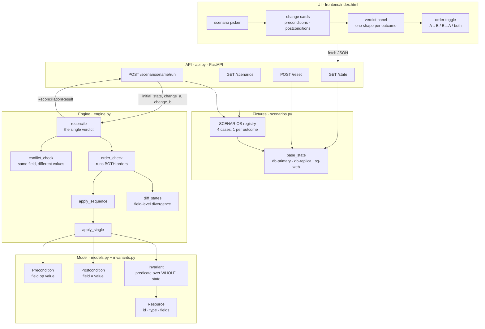
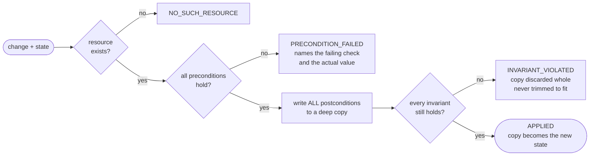

# ApplyMerge

Concurrent infrastructure changes are only meaningfully mergeable when each change
has explicit semantics, not when a model guesses what two operators "probably
meant." ApplyMerge is a simulated infrastructure state made of declarative
resources whose proposed changes include machine-readable preconditions, desired
postconditions, and invariants that must remain true. Two independent apply
operations may overlap in time and touch some of the same resources. The system
determines whether their effects commute, whether both intents can be preserved
in a single valid state, or whether the conflict is genuinely irresolvable
without choosing one side. It rejects combinations that violate declared
invariants rather than inventing a compromise. The final accepted state and any
rejected change are explainable directly from the declarative model and
automatically checked against its invariants.

## Architecture

Four layers, one direction of dependency. Nothing below the line knows the layer
above it exists, so the engine is testable and the model is reusable.



### How one apply is decided

`apply_single` is the only place the state is ever written, and it writes to a
**copy**. A rejected change leaves the caller's state byte-identical.



### How the pair is classified

Branch order is load-bearing. "No order applies both" is tested **before**
"the orders diverge" — otherwise an unrealisable pair would be labelled
`ORDER_DEPENDENT`, implying some order works when none does.


Only `MERGED` yields a state. For the other three the absence of a state **is**
the answer — the system never invents a compromise.

## Running it

```
pip install -r requirements.txt
uvicorn apply_merge.api:app --port 8000
```

Then open <http://127.0.0.1:8000/> for the UI, or `/docs` for the API.

```
pytest -q -p no:cacheprovider
```

## The model

Four declarative pieces, all in `apply_merge/models.py`:

- **Resource** — an id, a type, and a bag of fields. `db-primary` is a `database`
  with `replicas: 3, status: "active", tier: "silver"`.
- **Precondition** — what must be true *before* a change may apply, as
  `field op value` using `==`, `!=`, `<=` or `>=`. A precondition on a field that
  does not exist does not hold.
- **Postcondition** — a field this change sets, and the value it sets it to.
  Always an assignment, never an expression, so two changes writing one field can
  be compared directly.
- **Invariant** — a named rule over the *whole* state that must hold after any
  apply. `replica_cap` sums replicas across every database; `ssh_not_public`
  inspects each security group. Both use the same signature, so per-resource and
  cross-resource rules are the same kind of thing.

A **Change** targets one resource and carries its preconditions, postconditions,
a description, and an origin ("Alice" / "Bob").

## How to read a result

`reconcile(state, change_a, change_b)` returns exactly one of four outcomes. Three
of them produce **no state at all** — that absence is the answer, not an omission.

### MERGED

Both changes applied. The two write disjoint fields, both orders produce an
identical state, and every declared invariant was re-checked against the result.

The explanation names which fields were disjoint and lists the invariants
confirmed — not "OK", but `Invariants checked and confirmed: replica_cap,
ssh_not_public`.

### CONFLICT

Both changes write the **same field** of the same resource, to **different
values**. The explanation names the resource, the field, both values and both
authors.

Nothing is applied. Picking a side would discard an intent that was explicitly
declared, and averaging would invent one that nobody declared. Where the losing
side would *also* have broken an invariant on its own, the explanation says so,
so it is clear that choosing is not a way out.

### ORDER_DEPENDENT

Applying A-then-B and B-then-A give different answers — either the resulting
states diverge, or a change succeeds in one order and is rejected in the other.

This usually means one change's *precondition* reads a field the other change
*writes*. Note that such a pair can still have disjoint writes: a field-overlap
check calls them safe, and it is wrong. That is why the engine actually runs both
orders against copies rather than reasoning about fields.

Nothing is applied. One order may work perfectly, but nothing in the declarative
model says which operator came first, so choosing one would invent a priority.
Both candidate states are returned instead.

### INVARIANT_REJECTED

The changes do not overlap at all — often different resources entirely — and each
is valid on its own, but **no order applies both**, because their combined effect
breaks a declared invariant.

The explanation names the invariant and shows the arithmetic
(`total replicas = 11 (db-primary=5, db-replica=6), cap is 10`), then shows both
orders: whichever change is applied first fits, and the second never does.

Nothing is applied. The fault is in the combination, not in either change, so
neither is discarded and no request is quietly trimmed to fit.

## Reading an explanation

Every explanation is a compiler-style block: a headline, then indented detail.

```
INVARIANT_REJECTED: alice-scale-primary (Alice) and bob-scale-replica (Bob) each apply cleanly alone, but no order applies both.
  Invariant replica_cap: total replicas = 11 (db-primary=5, db-replica=6), cap is 10
  A-then-B  alice-scale-primary: APPLIED, bob-scale-replica: INVARIANT_VIOLATED
  B-then-A  bob-scale-replica: APPLIED, alice-scale-primary: INVARIANT_VIOLATED
  Whichever change is applied first fits; the second never does.
  Neither change is at fault, so neither is discarded.
```

Every value in it comes from the declarative model: resource ids, field names,
declared values, invariant names, and the invariant's own failure reason.

## Demo scenarios

Four, in `apply_merge/scenarios.py`, one per outcome:

| scenario | changes | outcome |
| --- | --- | --- |
| `safe_merge` | Alice tags `sg-web.owner`, Bob moves `sg-web.port` | MERGED |
| `conflict` | Alice sets `db-primary.replicas` to 5, Bob to 8 | CONFLICT |
| `order_dependent` | Alice promotes to gold *while active*, Bob sets status to maintenance | ORDER_DEPENDENT |
| `invariant_rejected` | Alice scales db-primary 3&rarr;5, Bob scales db-replica 4&rarr;6 | INVARIANT_REJECTED |

## Endpoints

| method | path | purpose |
| --- | --- | --- |
| GET | `/state` | current resources and the declared invariants |
| GET | `/scenarios` | all four demo cases with their changes |
| POST | `/scenarios/{name}/run` | reconcile that scenario, full structured result |
| POST | `/reset` | reset live state to a scenario's initial state, or the base state |

Scenario runs are pure: they reconcile against the scenario's own initial state
and never mutate the live one, so they can be run in any order, repeatedly, and
always agree.
