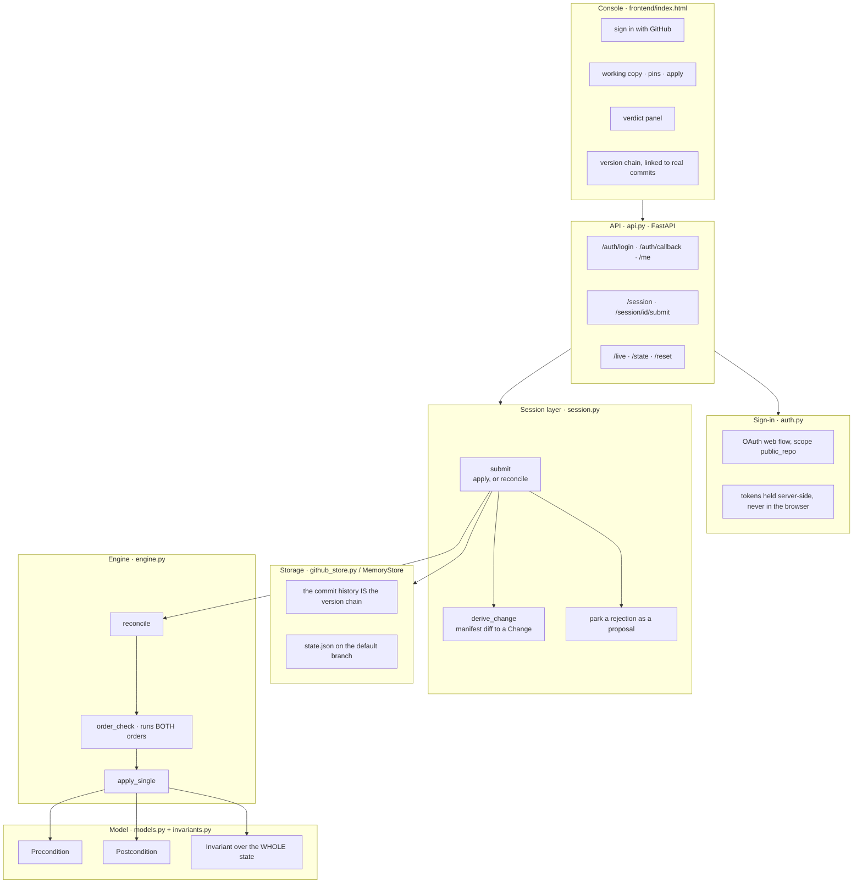
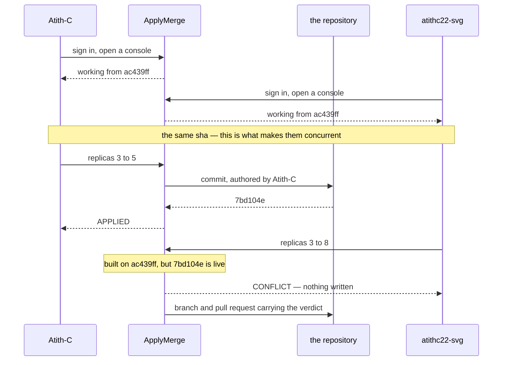
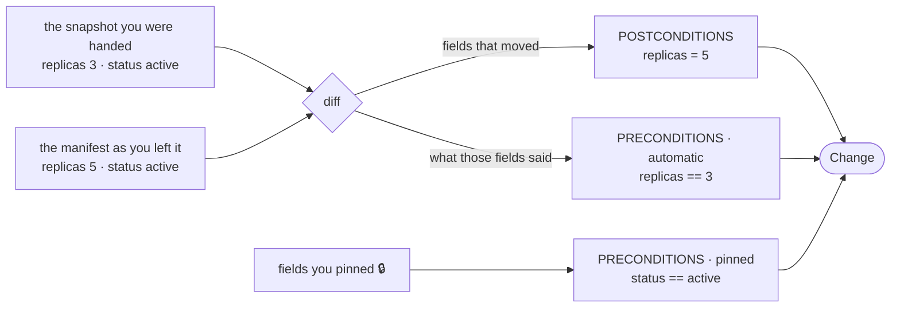
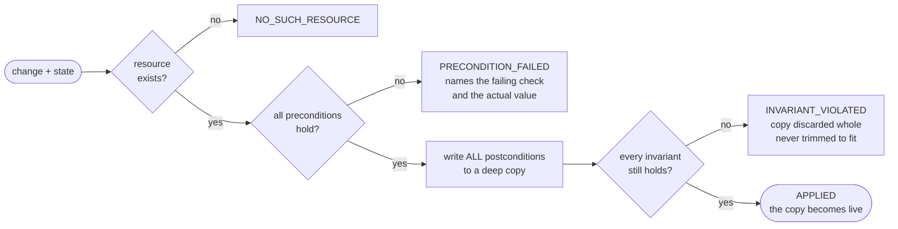
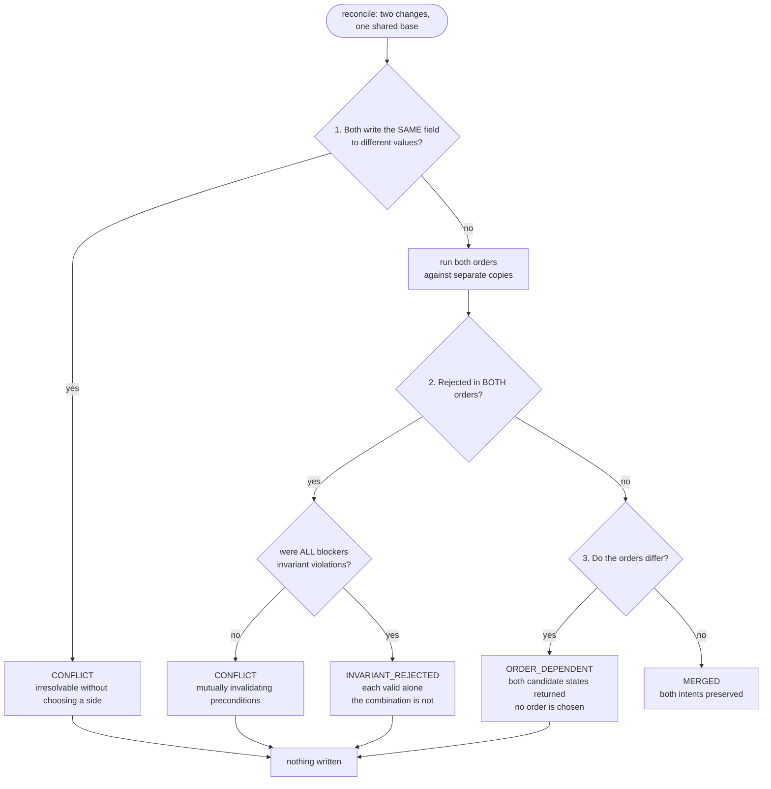

# ApplyMerge

Concurrent infrastructure changes are only meaningfully mergeable when each change
has explicit semantics, not when a model guesses what two operators "probably
meant." ApplyMerge is an infrastructure state made of declarative resources whose
proposed changes include machine-readable preconditions, desired postconditions,
and invariants that must remain true. Two independent apply operations may overlap
in time and touch some of the same resources. The system determines whether their
effects commute, whether both intents can be preserved in a single valid state, or
whether the conflict is genuinely irresolvable without choosing one side. It
rejects combinations that violate declared invariants rather than inventing a
compromise. The final accepted state and any rejected change are explainable
directly from the declarative model and automatically checked against its
invariants.

**The state is a real file in a real repository.** Operators sign in with their own
GitHub accounts. Nobody writes a change by hand: what you edit becomes the
postconditions, what you were looking at becomes the preconditions, and an accepted
change is a real commit authored by the person who made it. A rejected one becomes
an open pull request, because it was never wrong — it just could not go first.

> **Git gives you optimistic concurrency over bytes. This gives it over meaning.**

## The correspondence with git

The mapping is close enough that git supplies most of the machinery.

| ApplyMerge | git | who provides it |
| --- | --- | --- |
| version | commit sha | git |
| snapshot at a version | the tree at that commit | git |
| a session's base version | the commit a branch was cut from | git |
| "these two applies overlapped" | two sessions holding the same sha | git |
| the change that produced a version | the commit, and its message trailer | both |
| `derive_change` | `git diff` | ours, semantically typed |
| **`reconcile`** | `git merge` | **ours — this is the part git cannot do** |
| a rejected change | an open pull request | both |

GitHub's Contents API already implements an optimistic lock: you send the blob sha
you are replacing, and a stale one is refused. That lock is **per file**. Ours is
**per field, with declared semantics**, which is why two operators can edit the same
file at the same time and both succeed.

## Architecture

Six layers, one direction of dependency. The engine has no I/O, no clock and no
knowledge that sessions, GitHub or operators exist, so it is testable in isolation
and unchanged by everything above it.



### What makes two applies concurrent

A session is stamped with the commit that was live when it opened. Two sessions
holding the same sha **provably** overlapped in time — a fact recorded in the
repository, not an assumption in memory.



### How an edit becomes a declarative change



The automatic preconditions are an optimistic lock — *I decided this while looking
at 3* — and they need no engine support: a stale write fails its own precondition
through the ordinary path.

A **pin** is the other half. It declares a field you are *relying on* but not
changing. Without one, nothing reads a field it does not write, so no pair can be
order-dependent. **The pin is what creates the read.**

### How one apply is decided

`apply_single` is the only place state is written, and it writes to a **copy**. A
rejected change leaves the original byte-identical.



### How the pair is classified

Branch order is load-bearing. "No order applies both" is tested **before** "the
orders diverge" — otherwise an unrealisable pair would be labelled
`ORDER_DEPENDENT`, implying some order works when none does.



Only `MERGED` yields a state. For the other three the absence of a state **is** the
answer — the system never invents a compromise.

## Running it

```
pip install -r requirements.txt
uvicorn apply_merge.api:app --port 8000
```

Open <http://localhost:8000/>. Use `localhost`, not `127.0.0.1`: GitHub matches the
OAuth callback character for character.

```
pytest -q -p no:cacheprovider
```

### Two backends

`APPLYMERGE_BACKEND` decides where the state lives.

| | `memory` (default) | `github` |
| --- | --- | --- |
| state | in process | `state.json` in a repository |
| identity | two name boxes | sign in with GitHub |
| consoles | two, side by side | one — yours, plus who else is here |
| versions | `v0`, `v1`, … | real commit shas, linked |
| rejections | explained | explained **and** opened as pull requests |
| network | none | required |

**Memory mode is the fallback, not a leftover.** The whole reconciliation demo, the
four staged scenarios and all 158 tests run in it with no network and no
credentials. If the venue's wifi dies, one environment variable keeps the demo
alive.

### Configuration

Copy `.env.example` to `.env`. It is gitignored; nothing there belongs in the repo.

| variable | |
| --- | --- |
| `APPLYMERGE_BACKEND` | `memory` or `github` |
| `APPLYMERGE_REPO` | `owner/name` of the repo holding `state.json` |
| `GITHUB_CLIENT_ID` / `GITHUB_CLIENT_SECRET` | from an OAuth App; callback `http://localhost:8000/auth/callback` |
| `APPLYMERGE_TOKEN` | a read token. Optional, but unauthenticated reads are capped at 60 an hour per IP |

The OAuth scope is **`public_repo`** — write access to public repositories, and
nothing else. The state repo is public precisely so the narrower scope suffices.
Each operator's own token does their writing, so commits are authored by them
rather than by whoever started the server, and tokens are held server-side against
an opaque `httponly` cookie; the browser never sees one.

## Using the console

1. **Sign in with GitHub.** Open a second browser, or an incognito window, and sign
   in as someone else — one browser holds one GitHub session.
2. **Edit any value.** Edited fields turn amber.
3. **Pin** a field you are relying on but not changing.
4. **Your change** shows exactly what will be submitted — postconditions, automatic
   preconditions, pinned ones — *before* you apply anything.
5. **Apply.** The second person to apply is the one being reconciled.

Pinning something and changing nothing is also a submission: it **asserts** that
what you were shown still holds. Nothing is written — an empty commit would record
a question rather than a change — but you are told if someone moved it.

## The model

Four declarative pieces, all in `apply_merge/models.py`:

- **Resource** — an id, a type, and a bag of fields.
- **Precondition** — `field op value` using `==`, `!=`, `<=` or `>=`. A precondition
  on a field that does not exist does not hold.
- **Postcondition** — a field this change sets, and the value it sets it to. Always
  an assignment, so two changes writing one field can be compared directly.
- **Invariant** — a named rule over the *whole* state. `replica_cap` sums replicas
  across every database; `replicas_non_negative` and `ssh_not_public` inspect each
  resource. One signature covers per-resource and cross-resource rules alike.

Invariants live in code, not in the repository: a predicate in a JSON file is
either inert text or something dangerous to evaluate. **The repo holds the facts;
the program holds the rules.**

## How to read a result

`reconcile(state, change_a, change_b)` returns exactly one of four outcomes. Three
of them produce **no state at all** — that absence is the answer, not an omission.

### MERGED

Both changes applied. They write disjoint fields, both orders produce an identical
state, and every declared invariant was re-checked against the result. The
explanation names which fields were disjoint and lists the invariants confirmed —
not "OK", but `Invariants checked and confirmed: replica_cap,
replicas_non_negative, ssh_not_public`.

### CONFLICT

Both write the **same field** of the same resource, to **different values**. Nothing
is applied: picking a side discards an intent that was explicitly declared, and
averaging invents one nobody declared. Where the losing side would *also* have
broken an invariant on its own, the explanation says so, making clear that choosing
is not a way out.

### ORDER_DEPENDENT

A-then-B and B-then-A give different answers. This means one change's *precondition*
reads a field the other *writes*. Such a pair can still have disjoint writes — a
field-overlap check calls them safe, and it is wrong. That is why the engine runs
both orders against copies rather than reasoning about fields.

Nothing is applied. One order may work perfectly, but nothing in the declarative
model says who came first, so choosing would invent a priority. Both candidate
states are returned instead.

### INVARIANT_REJECTED

The changes do not overlap at all — often different resources entirely — each is
valid alone, but **no order applies both**, because their combined effect breaks a
declared invariant. The explanation shows the arithmetic
(`total replicas = 11 (db-primary=5, db-replica=6), cap is 10`) and both orders:
whichever goes first fits, the second never does.

Nothing is applied. The fault is in the combination, so neither change is discarded
and no request is quietly trimmed to fit.

## Rejected changes are kept

A refused change is not thrown away. It becomes a branch and an **open pull
request** carrying the full verdict.

The branch is cut from **the version its author was working on**, not from the head.
Cut from the head, the diff would read as reverting whatever landed — which is not
what they proposed, and a lie about their intent. Cut from their own base, the diff
**is** the disagreement, and GitHub renders the conflict natively.

## Reading an explanation

Every explanation is a compiler-style block: a headline, then indented detail.

```
INVARIANT_REJECTED: alice-scale-primary (Alice) and bob-scale-replica (Bob) each apply cleanly alone, but no order applies both.
  Invariant replica_cap: total replicas = 11 (db-primary=5, db-replica=6), cap is 10
  A-then-B  alice-scale-primary: APPLIED, bob-scale-replica: INVARIANT_VIOLATED
  B-then-A  bob-scale-replica: APPLIED, alice-scale-primary: INVARIANT_VIOLATED
  Whichever change is applied first fits; the second never does.
  Neither change is at fault, so neither is discarded.
```

Every value comes from the declarative model: resource ids, field names, declared
values, invariant names, and the invariant's own failure reason.

The same rigour reaches the repository. A commit message carries the change in
readable form *and* as a machine-readable trailer:

```
Scale db-primary for the launch

Resource: db-primary
Preconditions: replicas == 3, status == 'active'
Postconditions: replicas = 5
Invariants confirmed: replica_cap, replicas_non_negative, ssh_not_public
Reconciled against: nothing — the base was current

Applied-by: Atith-C

---8<--- applymerge
{"id":"atith-c-replicas-9c2f", ...}
---8<---
```

The trailer exists because **a pin is a read, and reads leave no trace in a diff**.
Without it a pinned precondition could never be recovered from history. With it,
`git log` alone is a complete audit trail of declared intent — and a stale session's
missed changes are reconstructed from exactly this.

## Demo scenarios

Four, in `apply_merge/scenarios.py`, one per outcome. One definition drives the
preset buttons, the pure `/scenarios` endpoints and the test suite.

| scenario | one operator | the other | outcome |
| --- | --- | --- | --- |
| `safe_merge` | `sg-web.owner` | `sg-web.port` | MERGED |
| `conflict` | `db-primary.replicas` = 5 | = 8 | CONFLICT |
| `order_dependent` | `db-primary.status` = maintenance | `tier` = gold, **pinned on `status`** | ORDER_DEPENDENT |
| `invariant_rejected` | `db-primary.replicas` = 5 | `db-replica.replicas` = 6 | INVARIANT_REJECTED |

Run `order_dependent` again with the pin removed and the same pair **merges**. That
one click is the whole difference between "these commute" and "the order decides".

## Endpoints

| method | path | |
| --- | --- | --- |
| GET | `/auth/login` | begin GitHub sign-in, with a single-use CSRF state |
| GET | `/auth/callback` | exchange the code, create a session |
| GET | `/me` | who this browser is, and who else is signed in |
| POST | `/auth/logout` | forget the session and its token |
| POST | `/session` | open an operator console, pinned to the live version |
| GET | `/session/{id}` | base version against live |
| POST | `/session/{id}/submit` | submit an edited manifest; applied or reconciled |
| POST | `/session/{id}/refresh` | rebase onto live after a rejection |
| GET | `/live` | state, version, the chain with commit links, who is connected |
| GET | `/state` | current resources and declared invariants |
| POST | `/reset` | rewind in memory; **re-sync**, never rewrite, against a repository |
| GET | `/scenarios` | the four canned cases |
| POST | `/scenarios/{name}/run` | reconcile that scenario, pure |
| GET | `/` | the console |
| GET | `/scenarios-view` | the canned walkthrough |

## Tests

```
pytest -q -p no:cacheprovider
```

**158 tests, entirely offline.** Every GitHub call goes through a transport seam, so
the suite runs with no network, no credentials and no rate limit. `conftest.py`
declares the test environment rather than inheriting `.env`.

Counts below are test functions; pytest collects 158 because some are parametrised.

| file | | covers |
| --- | --- | --- |
| `test_engine.py` | 44 | the model, `apply_single`, all four outcomes, the pure endpoints |
| `test_session.py` | 37 | versioning, change derivation, **all four outcomes reached through live concurrent editing** rather than fixtures |
| `test_github.py` | 18 | the API client, and a change surviving the round trip through a commit message |
| `test_github_store.py` | 22 | the commit history as a version chain, proposals, hand-made commits |
| `test_auth.py` | 23 | the CSRF state, the token exchange, and that the token never reaches the browser |

## Known limits

Stated rather than hidden. Each is a model change, not a missing branch.

- **One resource per submission.** `Change.resource_id` is a single id, so an edit
  spanning two resources is refused with an explanation rather than split. This is
  the largest obstacle to consuming real Terraform plans.
- **Assignment-only postconditions.** `replicas = 5`, never `replicas += 2`. Two
  relative increments genuinely commute where two assignments never can, and that
  cannot currently be expressed.
- **Merge base.** A session that missed several changes is reconciled against each
  from its own snapshot; strictly, each was built on the one before. With two
  operators the missed list is almost always length one.
- **A hand-made commit's reads are unknowable.** Editing `state.json` on github.com
  leaves no trailer. Its writes are reconstructed by diffing against the parent; its
  reads cannot be, because a read leaves no trace in a diff.
- **No drift, no partial application.** The recorded state is taken as the truth,
  and an apply is all-or-nothing. Real infrastructure is neither.
- **Sessions never expire**, so one abandoned console pins the snapshot history.
